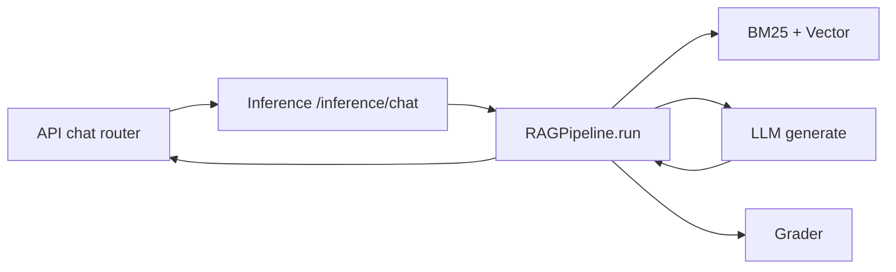
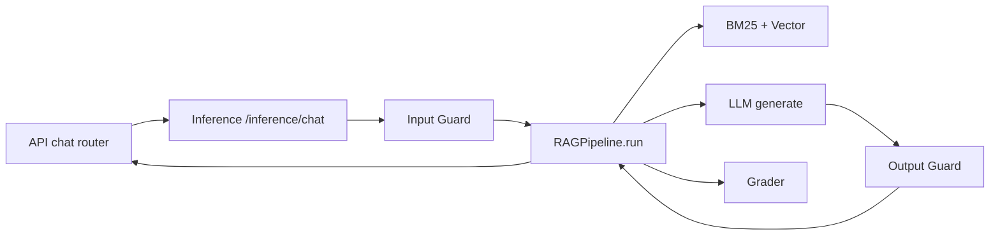

# Add Guardrails to Support Copilot

## Current Flow




User message flows: API → Inference → RAGPipeline → LLM → answer → API. No validation exists today.

## New Flow (with Guardrails)



With guardrails enabled: API → Inference → **Input Guard** (prompt injection, length) → RAGPipeline → LLM → **Output Guard** (toxic language, length) → Grader → API. On input failure, return refusal immediately. On output failure, return sanitized/fallback message.

## Approach

Use [guardrails-ai](https://docs.guardrailsai.com/) with Hub validators. Integrate in [inference/pipeline.py](commitment/job/cloud-ai/portfolio/support-copilot/inference/pipeline.py) so both chat and suggest_reply are protected.

## Implementation

### 1. Add dependency

In [inference/pyproject.toml](commitment/job/cloud-ai/portfolio/support-copilot/inference/pyproject.toml):

```toml
"guardrails-ai>=0.5.0",
```

Install validators via CLI (one-time, or document in README):

```bash
guardrails hub install hub://guardrails/detect_prompt_injection
guardrails hub install hub://guardrails/toxic_language
guardrails hub install hub://guardrails/valid_length  # or similar
```

### 2. Create guardrails module

New file: `inference/guardrails/__init__.py` (or `shared/guardrails.py` if reused by API)

- **Input guard**: `Guard` with `detect_prompt_injection` and `valid_length` (e.g. max 2000 chars). On fail: raise or return a safe refusal message.
- **Output guard**: `Guard.parse()` with `toxic_language` and `valid_length` (e.g. max 4000 chars). On fail: strip toxic content or return a generic fallback.

Configurable via env: `GUARDRAILS_ENABLED`, `GUARDRAILS_INPUT_MAX_LEN`, `GUARDRAILS_OUTPUT_MAX_LEN`.

### 3. Integrate in RAGPipeline

In [inference/pipeline.py](commitment/job/cloud-ai/portfolio/support-copilot/inference/pipeline.py):

- **Before retrieval** (start of `run`, `stream`, `suggest_reply`): call input guard on `question` (or `query` for suggest). If validation fails, return early with a refusal message (e.g. "I can only answer questions about our products and support policies.") instead of calling the LLM.
- **After LLM generate** (before citation extraction): call output guard on `result.text`. If validation fails, either re-ask the LLM (if library supports) or return a sanitized/fallback message.

### 4. Config

Add to [shared/config.py](commitment/job/cloud-ai/portfolio/support-copilot/shared/config.py):

```python
guardrails_enabled: bool = True
guardrails_input_max_len: int = 2000
guardrails_output_max_len: int = 4000
```

### 5. Tests

Add `inference/tests/test_guardrails.py`:

- Input: prompt injection pattern → refusal
- Input: over-length → refusal
- Output: toxic content → filtered or fallback

## Files to Create/Modify


| File                                 | Action                        |
| ------------------------------------ | ----------------------------- |
| `inference/pyproject.toml`           | Add guardrails-ai dep         |
| `inference/guardrails/__init__.py`   | New: input/output Guard setup |
| `inference/pipeline.py`              | Call guards before/after LLM  |
| `shared/config.py`                   | Add guardrails config         |
| `inference/tests/test_guardrails.py` | New: unit tests               |


## Fallback

If guardrails-ai or validators fail to load (e.g. missing hub install), log a warning and bypass guards (current behavior). This keeps the service running if the library has issues.