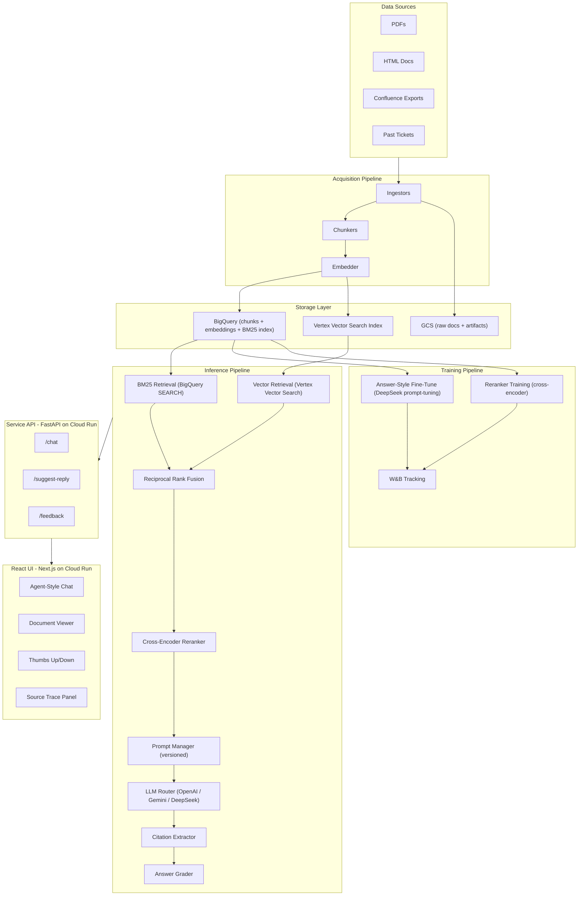

# Customer Support RAG Copilot

## Project Location

`/Users/adrian/study/commitment/job/cloud-ai/support-copilot/`

## Architecture Overview




## Directory Structure

```
support-copilot/
├── .github/workflows/
│   ├── acquisition-ci.yml        # Build + push acquisition image
│   ├── training-ci.yml           # Build + push training image, submit Vertex job
│   ├── app-ci-cd.yml             # Build API + UI + inference, deploy to Cloud Run
│   └── deploy-infra.yml          # Pulumi infra deployment
├── acquisition/                  # Module 1: Acquisition Pipeline
│   ├── Dockerfile
│   ├── pyproject.toml
│   ├── docker-shell.sh
│   ├── cli.py                    # Typer CLI: ingest, chunk, embed, load
│   ├── ingestors/
│   │   ├── __init__.py
│   │   ├── pdf.py                # PyMuPDF / pdfplumber
│   │   ├── html.py               # BeautifulSoup
│   │   ├── confluence.py         # Confluence export parser (HTML/XML)
│   │   └── tickets.py            # JSON/CSV ticket loader
│   ├── chunkers/
│   │   ├── __init__.py
│   │   ├── recursive.py          # LangChain RecursiveCharacterTextSplitter
│   │   └── semantic.py           # Semantic similarity chunker
│   ├── embedders/
│   │   ├── __init__.py
│   │   └── embed.py              # Vertex AI / OpenAI embedding (swappable)
│   └── stores/
│       ├── __init__.py
│       ├── bigquery.py           # Write chunks + embeddings to BQ table
│       └── vertex_index.py       # Upsert to Vertex Vector Search index
├── training/                     # Module 2: Training Pipeline
│   ├── Dockerfile
│   ├── pyproject.toml
│   ├── cli.py                    # Typer CLI: build-dataset, finetune, train-reranker, eval
│   ├── answer_style/
│   │   ├── __init__.py
│   │   ├── dataset.py            # Build Q&A pairs from tickets + docs
│   │   ├── finetune.py           # DeepSeek prompt-tuning via API or local LoRA
│   │   └── eval.py               # LLM-as-judge + ROUGE/BERTScore
│   ├── reranker/
│   │   ├── __init__.py
│   │   ├── dataset.py            # Build (query, pos_doc, neg_doc) triples
│   │   ├── train.py              # Cross-encoder fine-tune (sentence-transformers)
│   │   └── eval.py               # nDCG, MRR metrics
│   └── wandb_utils.py            # W&B dataset versioning, run logging, model registry
├── inference/                    # Module 3: Inference Pipeline
│   ├── Dockerfile
│   ├── pyproject.toml
│   ├── pipeline.py               # Orchestrates full RAG pipeline
│   ├── retrieval/
│   │   ├── __init__.py
│   │   ├── bm25.py               # BigQuery SEARCH() based BM25
│   │   ├── vector.py             # Vertex Vector Search client
│   │   └── hybrid.py             # Reciprocal Rank Fusion (RRF)
│   ├── reranker/
│   │   ├── __init__.py
│   │   └── cross_encoder.py      # Load fine-tuned cross-encoder, score + rerank
│   ├── generation/
│   │   ├── __init__.py
│   │   ├── llm_router.py         # OpenAI / Gemini / DeepSeek via config
│   │   ├── prompt_manager.py     # Versioned prompts (YAML + W&B tracking)
│   │   └── citations.py          # Extract + validate source citations
│   └── grading/
│       ├── __init__.py
│       └── grader.py             # Relevance, faithfulness, completeness scoring
├── api/                          # Module 4: Service API
│   ├── Dockerfile
│   ├── pyproject.toml
│   ├── app/
│   │   ├── main.py               # FastAPI app, CORS, middleware
│   │   ├── config.py             # Settings (Pydantic BaseSettings, Secret Manager)
│   │   ├── routers/
│   │   │   ├── __init__.py
│   │   │   ├── chat.py           # POST /chat, GET /chat/{id}, streaming
│   │   │   ├── suggest.py        # POST /suggest-reply (given ticket context)
│   │   │   └── feedback.py       # POST /feedback (thumbs + text)
│   │   ├── schemas/
│   │   │   ├── __init__.py
│   │   │   └── models.py         # Pydantic request/response models
│   │   ├── services/
│   │   │   ├── __init__.py
│   │   │   ├── chat_service.py   # Chat session management
│   │   │   └── feedback_service.py
│   │   └── middleware/
│   │       └── auth.py           # API key / JWT auth
│   └── tests/
│       ├── test_chat.py
│       ├── test_suggest.py
│       └── test_feedback.py
├── ui/                           # Module 5: React UI
│   ├── Dockerfile
│   ├── package.json
│   ├── next.config.js
│   ├── tailwind.config.js
│   ├── src/
│   │   ├── app/
│   │   │   ├── layout.tsx
│   │   │   ├── page.tsx          # Landing / dashboard
│   │   │   └── chat/
│   │   │       └── page.tsx      # Chat interface
│   │   ├── components/
│   │   │   ├── chat/
│   │   │   │   ├── ChatWindow.tsx
│   │   │   │   ├── MessageBubble.tsx
│   │   │   │   ├── StreamingMessage.tsx
│   │   │   │   └── SuggestReplyButton.tsx
│   │   │   ├── documents/
│   │   │   │   ├── DocumentViewer.tsx
│   │   │   │   └── SourceHighlight.tsx
│   │   │   ├── feedback/
│   │   │   │   ├── ThumbsUpDown.tsx
│   │   │   │   └── FeedbackModal.tsx
│   │   │   ├── source-trace/
│   │   │   │   ├── SourceTracePanel.tsx
│   │   │   │   └── CitationCard.tsx
│   │   │   └── layout/
│   │   │       ├── Sidebar.tsx
│   │   │       ├── Header.tsx
│   │   │       └── ThemeProvider.tsx
│   │   └── services/
│   │       └── api.ts            # Axios API client
├── shared/                       # Shared Python package
│   ├── pyproject.toml
│   ├── config.py                 # Shared config (GCP project, BQ dataset, etc.)
│   └── llm_provider.py           # Unified LLM interface (OpenAI/Gemini/DeepSeek)
├── prompts/                      # Versioned prompt templates
│   ├── v1/
│   │   ├── system.yaml
│   │   ├── answer.yaml
│   │   ├── suggest_reply.yaml
│   │   └── grading.yaml
│   └── v2/                       # Iterate prompt versions
├── infra/
│   ├── Pulumi.yaml
│   ├── Pulumi.dev.yaml
│   ├── __main__.py               # BigQuery dataset, GCS buckets, Vertex index,
│                                  # Cloud Run services, Pub/Sub, Cloud Tasks, Secret Manager
├── docker-compose.yml            # Local dev (all 5 services)
├── Makefile                      # Common commands
└── README.md
```

## Key Design Decisions

### 1. Swappable LLM Provider (`shared/llm_provider.py`)

A single `LLMProvider` class with a `generate()` method that routes to OpenAI, Gemini, or DeepSeek based on `LLM_PROVIDER` env var. Pattern from cheese-app's `llm_utils.py` but generalized:

```python
class LLMProvider:
    def __init__(self, provider: str, model: str):
        self.provider = provider  # "openai" | "gemini" | "deepseek"
        self.client = self._init_client()

    async def generate(self, messages, **kwargs) -> GenerationResult:
        ...  # routes to appropriate SDK

    async def stream(self, messages, **kwargs) -> AsyncIterator[str]:
        ...  # streaming for chat UX
```

### 2. BigQuery as Primary Store

Single BQ table `support_copilot.chunks`:

- `chunk_id` (STRING), `doc_id` (STRING), `source_type` (STRING: pdf/html/confluence/ticket)
- `title` (STRING), `content` (STRING), `metadata` (JSON)
- `embedding` (ARRAY of FLOAT64, 256-dim)
- `created_at` (TIMESTAMP), `version` (INT64)

BigQuery SEARCH() for BM25, BigQuery VECTOR_SEARCH() for vector retrieval. Vertex Vector Search index as a deployed endpoint for low-latency serving.

### 3. Hybrid Retrieval with Reciprocal Rank Fusion

```python
def hybrid_retrieve(query: str, top_k: int = 20) -> list[ScoredChunk]:
    bm25_results = bm25_search(query, top_k=top_k)      # BigQuery SEARCH
    vec_results  = vector_search(query, top_k=top_k)     # Vertex Vector Search
    fused = reciprocal_rank_fusion(bm25_results, vec_results, k=60)
    reranked = cross_encoder_rerank(query, fused[:top_k])
    return reranked
```

### 4. Prompt Versioning

YAML templates in `prompts/v{N}/` with Jinja2 placeholders. `prompt_manager.py` loads by version, logs to W&B for A/B tracking. Prompt metadata (version, hash, template) attached to every API response for traceability.

### 5. Answer Grading

Post-generation quality check using LLM-as-judge (separate call):

- **Relevance**: Does the answer address the question?
- **Faithfulness**: Is every claim grounded in retrieved sources?
- **Completeness**: Are all relevant source aspects covered?

Returns a `grade` object (`{"relevance": 0.9, "faithfulness": 0.95, "completeness": 0.8}`) alongside the answer. Low scores trigger a "low confidence" badge in the UI.

### 6. CI/CD (GitHub Actions)

Following the cheese-app-v4 pattern with commit-message triggers:

- `acquisition-ci.yml`: Triggered by `/run-acquisition` in commit message. Builds acquisition container, pushes to Artifact Registry, runs pipeline.
- `training-ci.yml`: Triggered by `/run-training`. Builds training container, submits Vertex AI custom job, validates metrics via W&B.
- `app-ci-cd.yml`: Triggered by `/deploy-app`. Builds API + inference + UI images, deploys to Cloud Run (or GKE via Pulumi).

### 7. W&B Integration

Following the DoseWise pattern from [ac215-project/model_training/package/trainer/task.py](hrv/ac215/project/ac215-project/model_training/package/trainer/task.py):

- **Datasets**: Version chunk datasets and Q&A training pairs as W&B Artifacts
- **Runs**: Log training metrics (loss, nDCG, MRR) per epoch
- **Eval Tables**: Log retrieval eval results (query, retrieved docs, relevance) as W&B Tables
- **Model Registry**: Register fine-tuned reranker and answer-style model checkpoints

### 8. React UI

Next.js 14 App Router with Tailwind + shadcn/ui (following cheese-app-v4's frontend-react pattern but modernized):

- **Agent-style Chat**: Left sidebar (history), center chat with streaming, right panel (source trace)
- **Document Viewer**: Click a citation to open the source document with highlighted passage
- **Thumbs Up/Down**: Inline on each message, opens optional text feedback modal
- **Source Trace**: Collapsible panel showing retrieved chunks, reranker scores, and prompt version used

## Reference Patterns to Reuse

- **Docker + `uv`**: From [cheese-app-v4/src/api-service/Dockerfile](commitment/job/cloud-ai/hrv215/lec21-cicd-review/cheese-app-v4/src/api-service/Dockerfile) -- Python 3.12-slim, `uv` for deps, non-root user
- **FastAPI router structure**: From [cheese-app-v4/src/api-service/api/routers/llm_rag_chat.py](commitment/job/cloud-ai/hrv215/lec21-cicd-review/cheese-app-v4/src/api-service/api/routers/llm_rag_chat.py) -- chat CRUD, session management
- **RAG chunking**: From [llm-rag/cli.py](hrv/ac215/tutorials/llm-rag/cli.py) -- 3 chunking strategies, embedding batching with retry
- **CI/CD workflows**: From [cheese-app-v4/.github/workflows/](commitment/job/cloud-ai/hrv215/lec21-cicd-review/cheese-app-v4/.github/workflows/) -- commit-message triggers, Docker-in-Docker, GCP auth
- **W&B tracking**: From [ac215-project/model_training/](hrv/ac215/project/ac215-project/model_training/) -- wandb.login, config logging, metric logging
- **Next.js frontend**: From [cheese-app-v4/src/frontend-react/](commitment/job/cloud-ai/hrv215/lec21-cicd-review/cheese-app-v4/src/frontend-react/) -- App Router, Tailwind, chat components, DataService pattern

## Implementation Order

Build bottom-up: shared config -> acquisition -> inference -> API -> UI -> training -> CI/CD -> infra.